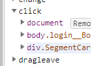
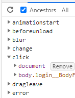

## appearance
오늘 Next.js 반응형 작업을 하던 도중 input 이 Mobile chrome 에서 이상하게 나타나는 경우가 있었다. 
여러가지 구글링을 해본결과 다음 프로퍼티를 추가해주면 된다. 설명을 보니 OS종속적인 스타일링을 해준다는 것 같다.
```css
.thing {
   -webkit-appearance: none;
   -moz-appearance:    none;
   appearance:         none;
}
``` 

## ForwardRef 

Next js에서 라우팅을 담당하는 next/link 모듈이 있다. 하지만 반응형을 적용할 때 제대로 라우팅이 되지않는 현상이 발생했다.
그 이유로 예상하는것은 Link 컴포넌트 하위에 useMediaQuery("(max-width : 480px)")를 이용해 두가지로 나누어 렌더링했는데
하나만 적용 된 걸로보아 첫 번째 새로고침 또는 페이지 렌더링을 할 때 onClick 이벤트를 붙이고 matches가 동작해
반응형 내에서는 onClick 이벤트가 안붙는 것이다.

 
> 같은 컴포넌트이다.

해결방법은 Link 컴포넌트에 passHref prop을 true로 주고 styledComponent로 Custom Anchor 태그를 만들어 적용하면 matches에 
따라 onClick 이벤트가 붙지않고 a 태그로 라우팅이 가능하다!

다음은 next/link doc에 나온 방법이다.
```javascript
import Link from 'next/link'
import styled from 'styled-components'

// This creates a custom component that wraps an <a> tag
const RedLink = styled.a`
  color: red;
`

function NavLink({ href, name }) {
  // Must add passHref to Link
  return (
    <Link href={href} passHref>
      <RedLink>{name}</RedLink>
    </Link>
  )
}

export default NavLink
```

다음과같이하면 라우팅이 onClick으로 들어가지 않고 <a> 태그로 된다

