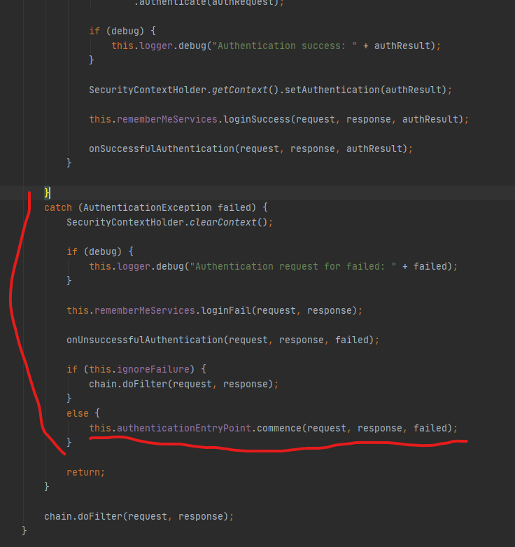

1. ~~Provider 구현체 DaoAuthenticationProvider~~
2. ~~UserDetailsService 구현체 CustomUserDetailsService~~
3. ~~User Entity 및 UserPrincipal~~
4. ~~Authentication Handler 등록~~
5. ~~header인증을 위한 BasicAuthenticationFilter 구현체 JwtAuthorizationFilter~~
6. AuthenticationEntryPoint 구현체 CustomAuthenticationEntryPoint
7. ErrorResponseDTO

지금까지 기본 인증 과정을 구현했다. 이제 에러를 핸들링하는 방법에 대해 알아보자.

기본적으로 Security Error를 제외한 나머지 Controller Error들은 AdviceController에서 모든 오류를 한곳에서 처리할 수 있다.
그리고 Security Error도 forward 시키면 Controller 단에서 받아서 처리할 수 있다. 하지만 뭔가 불 필요한 낭비라고 생각하기 때문에
Security Error는 Security 단에서 처리하도록 할 것이다.

기본적으로 JwtAuthenticationFilter에서 오류는 SecurityHandler 클래스를 작성해서 처리하였으니 JwtAuthorizationFilter 내부에서
일어나는 에러를 처리해보자.

전에 Filter를 만들었을 때 Header인증을 담당하는 BasicAuthenticationFilter 를 상속받아 구현했었다. 원래 코드를 보면
;

 
