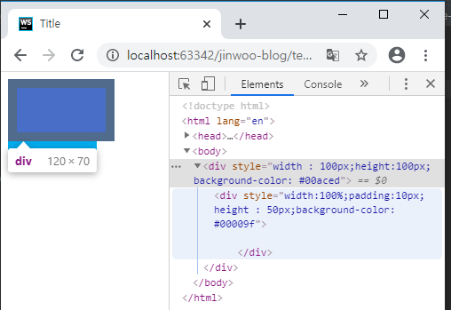
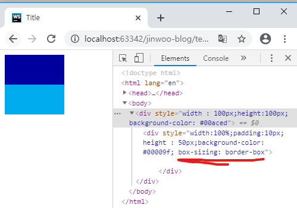

```html
<!DOCTYPE html>
<html lang="en">
<head>
    <meta charset="UTF-8">
    <title>Title</title>
</head>
<body>
<div style="width : 100px;height:100px;background-color: #00aced">
    <div style="width:100%;padding:10px;height : 50px;background-color: #00009f">
        
    </div>
</div>
</body>
</html>

```

위와같이 코드를 작성하면 자식 div태그에서 width:100%로 부모 영역안에 위치한다고 생각 할 수 있다. 하지만 실제 결과를보면


다음과같이 부모의 영역을 벗어나는 것을 알 수 있다. 이 이유는 기본 box-sizing이 content-box로 설정되어있어서인데
해당 두번째 영역을 box-sizing : border-box; 로 설정하면 border영역까지가 width로 잡히기때문에 부모영역안으로 들어 갈 수 있다.

