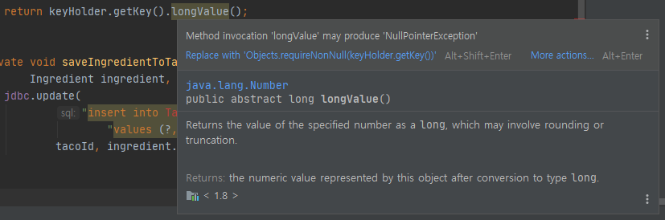

최근에 스프링 인 액션 5 책을 보고있는데 문제점이 한두개가 아니다. 책 소개글에 이전 버전에 나타난 여러 문제들을 해결했다고
나와있는데 전혀 그런 것 같지 않다. 가뜩이나 스프링 잘못해서 사서 공부하는데 해결하는데 시간이 더 많이 든다.. ㅠㅠ

또 예제 리파지토리는 실행해보고 올린것인지 의문이 든다. 

우선 첫 번째로 헤맸던 것은
```java
@Slf4j
@Controller
@RequestMapping("/design")
@SessionAttributes("order")
public class DesignTacoController {

	private final IngredientRepository ingredientRepo;
	
	private TacoRepository tacoRepo;

	@Autowired
	public DesignTacoController(
			IngredientRepository ingredientRepo, TacoRepository tacoRepo) {
	  this.ingredientRepo = ingredientRepo;
	  this.tacoRepo = tacoRepo;
	}

	@GetMapping
	  public String showDesignForm(Model model) {
	    
		List<Ingredient> ingredients = new ArrayList<>();
	    ingredientRepo.findAll().forEach(i -> ingredients.add(i));

	    Type[] types = Ingredient.Type.values();
	    for (Type type : types) {
	      model.addAttribute(type.toString().toLowerCase(),
	          filterByType(ingredients, type));
	    }

	    model.addAttribute("taco", new Taco());

	    return "design";
	  }
	
	  private List<Ingredient> filterByType(
	      List<Ingredient> ingredients, Type type) {
	    return ingredients
	              .stream()
	              .filter(x -> x.getType().equals(type))
	              .collect(Collectors.toList());
	  }

	  @ModelAttribute(name = "order")
	  public Order order() {
	    return new Order();
	  }

	  @ModelAttribute(name = "taco")
	  public Taco taco() {
	    return new Taco();
	  }

	  @PostMapping
	  public String processDesign(
			  @Valid Taco design, 
			  Errors errors, @ModelAttribute Order order) {
		  if (errors.hasErrors()) {
			 return "design";
		  }

		  Taco saved = tacoRepo.save(design);
		  order.addDesign(saved);

		  return "redirect:/orders/current";
	  }

}
```
https://github.com/Jpub/SpringInAction5 원 제작자 측이 아닌 출판사 측에서 만든 리포를 가져왔다. ch3/ch03-jdcb부분이다
처음에 GET메소드로 thymeleaf페이지를 가져오고 submit form을 하면 재료가 전달되서 POST메소드에서 처리하는 간단한
컨트롤러이다. 

하지만 POST메소드를 보면 @Valid 를 통해 검증하고 에러가 존재하면 다시 design 페이지를 반환하는데 이 때 
재료 model객체가 사라져 다음과 같이 표시된다.

우선 이것을 해결하는 방법은 
```java
    @ModelAttribute
    public void addIngredientToModel(Model model){
        List<Ingredient> ingredients = new ArrayList<>();
        ingredientRepo.findAll().forEach(i -> ingredients.add(i));

        Type[] types = Ingredient.Type.values();
        for (Type type : types) {
            model.addAttribute(type.toString().toLowerCase(),
                    filterByType(ingredients, type));
        }
    }
    @GetMapping
    public String showDesignForm(Model model) {
        model.addAttribute("taco", new Taco());
        return "design";
    }
```
다음과 같이 리팩토링 한다. 메소드에 @ModelAttribute를 붙임으로서 GET메소드에만 model에 적용 되지 않고 해당 컨트롤러
전체에 적용되도록 한다.

이제 두번째 문제를 보자.
```java
@Repository
public class JdbcTacoRepository implements TacoRepository {

	private JdbcTemplate jdbc;

	  public JdbcTacoRepository(JdbcTemplate jdbc) {
	    this.jdbc = jdbc;
	  }

	  @Override
	  public Taco save(Taco taco) {
	    long tacoId = saveTacoInfo(taco);
	    taco.setId(tacoId);
	    
	    // 스프링 Converter를 우리가 구현한 IngredientByIdConverter의 Convert() 메서드가 이때 자동 실행된다.
	    for (Ingredient ingredient : taco.getIngredients()) { 
	      saveIngredientToTaco(ingredient, tacoId);
	    }

	    return taco;
	  }

	  private long saveTacoInfo(Taco taco) {
	    taco.setCreatedAt(new Date());
	    PreparedStatementCreator psc =
	        new PreparedStatementCreatorFactory(
	            "insert into Taco (name, createdAt) values (?, ?)",
	            Types.VARCHAR, Types.TIMESTAMP
	        ).newPreparedStatementCreator(
	           Arrays.asList(
	               taco.getName(),
	               new Timestamp(taco.getCreatedAt().getTime())));

	    KeyHolder keyHolder = new GeneratedKeyHolder();
	    jdbc.update(psc, keyHolder);

	    return keyHolder.getKey().longValue();
	  }

	  private void saveIngredientToTaco(
	          Ingredient ingredient, long tacoId) {
	    jdbc.update(
	        "insert into Taco_Ingredients (taco, ingredient) " +
	        "values (?, ?)",
	        tacoId, ingredient.getId());
	  }

}
```
위 코드를 보면 IDE 에서 다음과 같이 알려준다

에엥 난 책에있는대로 했는데 NPE가 발생한다고? 물론 출판사 깃헙 리포에도 똑같다. 
에러를 검색해보니 
```java
    private long saveTacoInfo(Taco taco) {
        taco.setCreatedAt(LocalDateTime.now());
        PreparedStatementCreatorFactory pscf = new PreparedStatementCreatorFactory(
                "Insert into Taco(name, createdAt) values(?,?)", Types.VARCHAR, Types.TIMESTAMP);
        pscf.setReturnGeneratedKeys(Boolean.TRUE); // 추가
        PreparedStatementCreator psc = pscf.newPreparedStatementCreator(
                Arrays.asList(taco.getName(), Timestamp.valueOf(taco.getCreatedAt())));
        KeyHolder keyHolder = new GeneratedKeyHolder();
        jdbc.update(psc, keyHolder);
        return keyHolder.getKey().longValue();
    }
```
다음과 같이 하면 된다.

아직 책 초반인데 시간을 너무많이 잡아먹는 것 같다. 힘들다.
