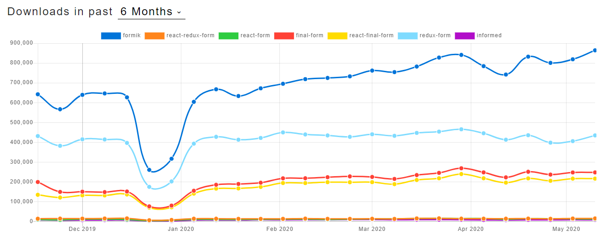
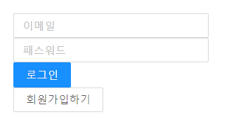

## 프로젝트 생성
```bash
npx create-react-app [프로젝트 명] --typescript
```
위 커맨드로 프로젝트를 만들어주고 라우팅을 위해 다음을 설치한다.
```bash
npm i react-router-dom @types/react-router-dom history
``` 
이후 App.tsx 파일 안에 다음과 같이 라우팅 해줍니다.
```tsx
import React from 'react';
import {Router , Route, Switch} from 'react-router-dom';
import {createBrowserHistory} from 'history';
import LoginForm from './components/LoginForm';

export const history = createBrowserHistory();

function App() {
  return (
    <Router history={history}>
      <Switch>
        <Route component={LoginForm} to={"/login"} exact/>
      </Switch>
    </Router>
  );
}

export default App;

```
일반적으로 [react-router-dom]('https://reacttraining.com/react-router/web/guides/quick-start') 공식 사이트에서는 
BrowserRouter를 사용하는데 나 같은 경우에는 조금있다가 사용할 redux 미들웨어인 thunk 함수내에서 라우팅을 하기 위해서
추상화된 BrowserRouter 대신 기본 Router를 사용하고 history를 직접 넣었다.


이제 로그인폼 컴포넌트를 만들어보자. 
```nashorn js
npm i formik
``` 
사실 다른 form 상태관리 라이브러리는 사용해보지 않았다... 그냥 npm trend에서 많이 사용한다길래 선택한 것일 뿐

그리고 이거는 방금안 사실인데 그냥 formik만 사용하기엔 너무 밋밋해 보일 것같아서 antd를 사용해 기본적인 디자인을 주려했는데 
아예 결합된 라이브러리가 있었다. 그래서 설치했다.
```nashorn js
npm i formik-antd antd
```
기본적으로 form 상태 관리를 사용하지 않으면 다음과같이 코드량이 상당히 늘어나고 관리하기도 힘들다.

```tsx
import React , {useState, ChangeEvent}from 'react';

function LoginForm () {
  const [email,setEmail] = useState('')
  const [password,setPassword] = useState('')
  const onChangeEmail = (e : ChangeEvent<HTMLInputElement>)=>{
      setEmail(e.target.value);
  }
  const onChangePassword = (e : ChangeEvent<HTMLInputElement>)=>{
      setPassword(e.target.value);
  }
  return (
      <form>
        <input value={email} onChange={onChangeEmail}/>
        <input value={password} onChange={onChangePassword}/>
      </form>  
    )
}
``` 
기본적으로 입력 받고 상태만 관리하는데 벌써 코드량이 많아졌다.. 물론 changeMethod도 하나로 하고 useState도 하나로면 
더 줄일 수 있겠으나 여간 귀찮은게 아니다. 그런데 formik 라이브러리를 사용하면
```tsx
import { Button } from 'antd';
import React from 'react'
import { SubmitButton, Form, Input } from 'formik-antd'
import { Formik } from 'formik'
import { Link } from 'react-router-dom';

export interface ILoginValue {
  email: string;
  password: string;
}
function LoginForm() {
    const initialValue: ILoginValue = {email: '', password: ''};
    return (
      <div style={{padding : '24px' , width: '300px'}}>
        <Formik
          initialValues={initialValue}
          render={() => (
            <Form>
              {/* every formik-antd component must have the 'name' prop set: */}
              <Input name='email' placeholder='이메일' />
              <Input name='password' placeholder='패스워드' />
              {/* the rest of the api stays as is */}
              <SubmitButton>로그인</SubmitButton>
            </Form>
          )}
          onSubmit={(value,helpers)=>{
            setTimeout(()=>(helpers.setSubmitting(false)),200);
            console.log(value);
          }}/>
        <Link to={"/signup"}>
            <Button>회원가입하기</Button>
        </Link>
      </div>
    )
}
export default LoginForm;

```
다음과 같이 깔끔해진다. 로그인 만들었던 것 처럼 회원가입도 만들자!
```tsx
import React from 'react'
import { SubmitButton, Form, Input } from 'formik-antd'
import { Formik } from 'formik'

export interface ISignupValue {
  email: string;
  username: string;
  password: string;
}

function SignUpForm() {
  const initialValue: ISignupValue = {email: '', username: '', password: ''}
  return (
    <div style={{padding : '24px' , width: '300px'}}>
      <Formik
        initialValues={initialValue}
        render={() => (
          <Form>
            {/* every formik-antd component must have the 'name' prop set: */}
            <Input name='email' placeholder='이메일' />
            <Input name='username' placeholder='이름' />
            <Input name='password' placeholder='패스워드' />
            {/* the rest of the api stays as is */}
            <SubmitButton>회원가입</SubmitButton>
          </Form>
        )}
        onSubmit={(value,helpers)=>{
          setTimeout(()=>(helpers.setSubmitting(false)),200);
          console.log(value);
        }}/>
    </div>
  )
}
export default SignUpForm;

```


그리고 라우팅도 추가해주자
```tsx
import React from 'react';
import {Router , Route} from 'react-router-dom';
import {createBrowserHistory} from 'history';
import LoginForm from './components/LoginForm';
import SignUpForm from './components/SignUpForm';

export const history = createBrowserHistory();

function App() {
  return (
    <Router history={history}>
      <Route exact component={LoginForm} to={"/login"} />
      <Route exact component={SignUpForm} to={"/signup"}/>
    </Router>
  );
}

export default App;

```
기본적인 회원가입 및 로그인 컴포넌트를 완성했다.

다음 포스트에서는 Spring Boot를 활용한 JWT 로그인, 회원가입을 구현해볼 예정이다. 


