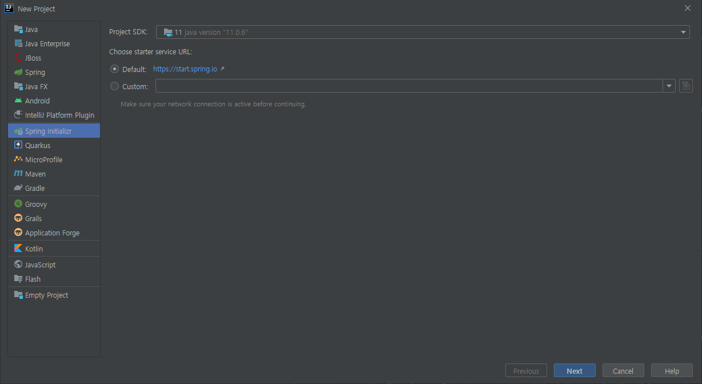
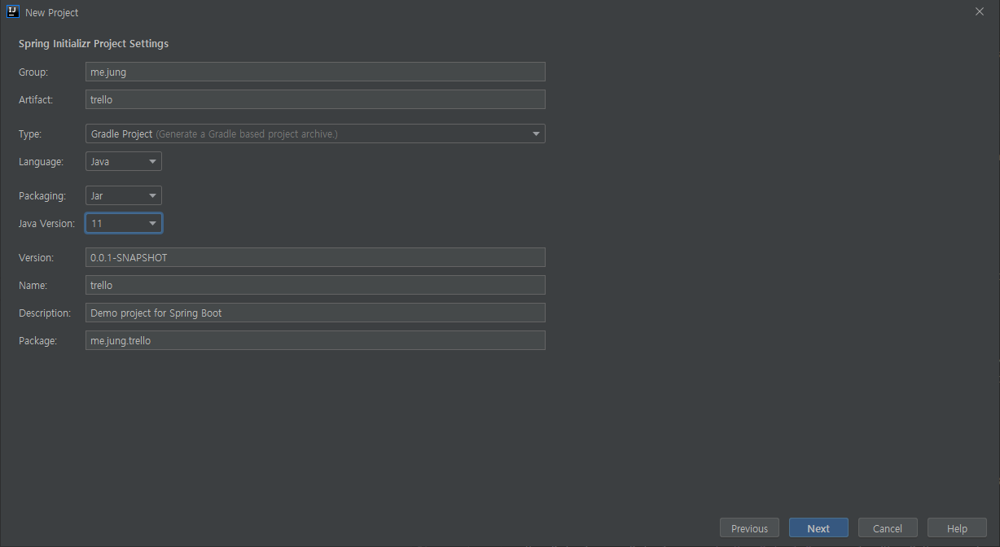
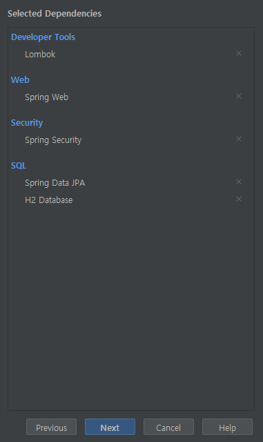
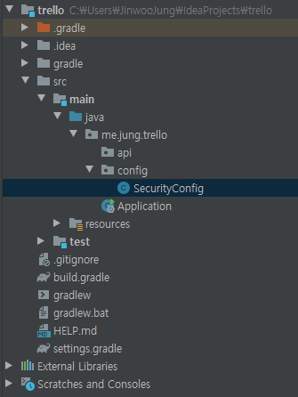
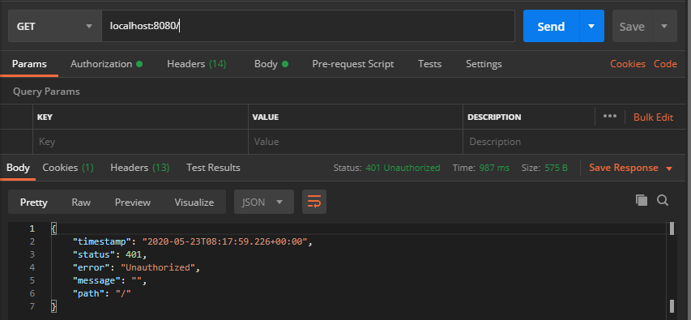
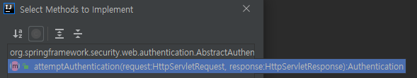

> Spring은 배운지 얼마안됐고 security는 더더욱 안됐다.
>
> 정확하지 않을 수 있습니다.
## springboot 프로젝트 생성

나는 Intellij 안의 spring initializer를 사용했지만 직접 스프링이니셜라이저 사이트에
들어가서 다운받는거랑 같다.



지금 프로젝트에서는 이정도만 설치하자.



그리고 api, config 패키지를 다음과 같이 생성하자


```java
// SecurityConfig.class
@Configuration
@EnableWebSecurity
public class SecurityConfig extends WebSecurityConfigurerAdapter {
}
```
그리고 어떤 요청을 해보면 다음과 같이 401에러를 내려준다.

기본적으로 모든 요청에 인증이 필요하기 때문이다. 앞으로 method를 오버라이드해서 
설정들을 변경해볼 것이다.

### 인증(Authentication)

우선 로그인 과정부터 생각해 보자.
 

 ```json
{
  "email" : "any@abc.com",
  "password" : "1234"
}
```
 1. 프론트에서는 /api/auth/login 으로 위와 같은 json을 보낸다.  
 2. Security filter chain에서 "특정 filter"에서 해당 정보를 AuthenticationToken으로 만들어서
 AuthenticationManager한테 전달 한 후 인증해달라고 한다.
 3. AuthenticationManager는 현재 등록되어있는 Provider들한테 인증요청한다.  
 4. Provider는 UserDetailService한테 DB에 존재하는지 존재하면 UserDetails를 반환해달라고 한다.
 5.  
 
 
 여기서 "특정 filter"로는 AbstractAuthenticationProcessingFilter를 상속받은 JwtAuthenticationFilter를 만들었다. 그 뒤 
attemptAuthentication메소드를 재정의 해주면 된다.

이 필터의 역활은 자기가 가지고있는 AuthenticationManager한테 (인증되지 않은)Authentication을 넘기면서 인증 해달라고 요청
한 뒤 결과로 (인증된) Authentication을 받아서 successfulAuthentication를 호출하고 다음필터로 넘어간다. 그전에 에러가 
발생하면 unsuccessfulAuthentication를 호출한다.

우선 사용자의 로그인 정보를 담을 DTO를 생성하자
 
```java
@Getter
@NoArgsConstructor
public class LoginRequestDTO {
    private String email;
    private String password;
}
```
다음으로 Authentication 인터페이스의 구현체인 AbstractAuthenticationToken을 상속받은 JwtAuthenticationToken을 만들자
```java
public class JwtAuthenticationToken extends AbstractAuthenticationToken {
    private final Object principal;
    private final String credentials;

    public JwtAuthenticationToken(Collection<? extends GrantedAuthority> authorities,Object principal, String credentials) {
        super(authorities);
        setAuthenticated(true);
        this.principal = principal;
        this.credentials = credentials;
    }

    public JwtAuthenticationToken(Object principal, String credentials) {
        super(null);
        setAuthenticated(false);
        this.principal = principal;
        this.credentials = credentials;
    }

    @Override
    public Object getCredentials() {
        return null;
    }

    @Override
    public Object getPrincipal() {
        return null;
    }
}
```
그리고 attemptAuthentication 추상 메소드를 override해서 구현해주자.

```java
public class JwtAuthenticationFilter extends AbstractAuthenticationProcessingFilter {
    private static final String ERROR_MESSAGE = "Something went wrong while parsing /login request body";
    ObjectMapper objectMapper;

    protected JwtAuthenticationFilter(ObjectMapper objectMapper) {
        super(new AntPathRequestMatcher("/api/auth/login", "POST"));
        this.objectMapper = objectMapper;
    }

    @Override
    public Authentication attemptAuthentication(HttpServletRequest request, HttpServletResponse response) throws AuthenticationException, IOException, ServletException {
        if (!request.getMethod().equals("POST")) {
            throw new AuthenticationServiceException(
                    "Authentication method not supported: " + request.getMethod());
        }
        try {
            LoginRequestDTO credentials = objectMapper.readValue(request.getInputStream(),LoginRequestDTO.class);
            JwtAuthenticationToken authenticationToken = new JwtAuthenticationToken(
                    credentials.getEmail(),
                    credentials.getPassword()
            );
            Authentication auth = this.getAuthenticationManager().authenticate(authenticationToken);
            return auth;
        }catch (IOException e){
            throw new InternalAuthenticationServiceException(ERROR_MESSAGE, e);
        }
    }
}
```
여기서 눈여겨 보아야 할 점은 JwtAuthenticationToken을 만들어서 AuthenticationManager한테 authenticate해달라고 요청 하는 
부분이다. 
SecurityConfig에서 AuthenticationManager를 등록해야한다. 그리고 기타 설정들을 추가하자

```java
@RequiredArgsConstructor
@Configuration
@EnableWebSecurity
public class SecurityConfig extends WebSecurityConfigurerAdapter {
    private final CustomUserDetailsService customUserDetailsService;
    private final ObjectMapper objectMapper;
    private final SecurityHandler securityHandler;
    private final CustomAuthenticationEntryPoint customAuthenticationEntryPoint;
    @Override
    protected void configure(AuthenticationManagerBuilder auth) throws Exception {
        auth.authenticationProvider(authenticationProvider());
    }

    @Override
    public void configure(WebSecurity web) throws Exception {
        web.ignoring()
                .antMatchers("/resources/**")
                .antMatchers("/css/**")
                .antMatchers("/vendor/**")
                .antMatchers("/js/**")
                .antMatchers("/favicon*/**")
                .antMatchers("/img/**")
        ;
    }

    @Override
    protected void configure(HttpSecurity http) throws Exception {
        http.headers().frameOptions().disable();
        http
                // remove csrf and state in session because in jwt we do not need them
                .csrf().disable()
                .sessionManagement().sessionCreationPolicy(SessionCreationPolicy.STATELESS)
                .and()
                // add jwt filters (1. authentication, 2. authorization)
                .addFilter(jwtAuthenticationFilter())
                .addFilter(jwtAuthorizationFilter())
                .authorizeRequests()
                // configure access rules
                .antMatchers(HttpMethod.POST, "/api/auth/**").permitAll()
                .antMatchers("/h2-console/**").permitAll()
                .antMatchers("/api/public/management/*").hasRole("MANAGER")
                .antMatchers("/api/public/admin/*").hasRole("ADMIN")
                .anyRequest().authenticated()
                .and()
                .exceptionHandling()
                .authenticationEntryPoint(customAuthenticationEntryPoint);
    }

    @Bean
    public AuthenticationProvider authenticationProvider() {
        DaoAuthenticationProvider daoAuthenticationProvider = new DaoAuthenticationProvider();
        daoAuthenticationProvider.setPasswordEncoder(passwordEncoder());
        daoAuthenticationProvider.setUserDetailsService(customUserDetailsService);
        return daoAuthenticationProvider;
    }

    @Bean
    public JwtAuthenticationFilter jwtAuthenticationFilter() throws Exception {
        JwtAuthenticationFilter filter = new JwtAuthenticationFilter(objectMapper);
        filter.setAuthenticationManager(authenticationManager());
        filter.setAuthenticationSuccessHandler(securityHandler);
        filter.setAuthenticationFailureHandler(securityHandler);
        filter.afterPropertiesSet();
        filter.setFilterProcessesUrl("/api/auth/signin");
        return filter;
    }
    @Bean
    public JwtAuthorizationFilter jwtAuthorizationFilter () throws Exception {
        JwtAuthorizationFilter filter = new JwtAuthorizationFilter(authenticationManager(),customUserDetailsService);
        return filter;
    }
    @Bean
    public PasswordEncoder passwordEncoder() {
        return new BCryptPasswordEncoder();
    }
}
```
여기서 아직 구현하지 않은 것들이 있는데 만들어야 할 것들에는 
1. Provider 구현체 DaoAuthenticationProvider
2. AuthenticationEntryPoint 구현체 CustomAuthenticationEntryPoint
3. header인증을 위한 BasicAuthenticationFilter 구현체 JwtAuthorizationFilter
4. User Entity 및 UserPrincipal 
5. UserDetailsService 구현체 CustomUserDetailsService
6. ErrorResponseDTO

는 다음포스트에서 만들자


