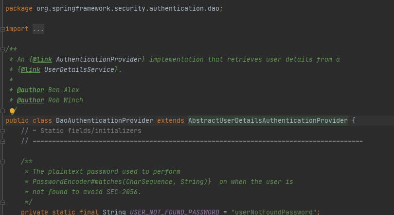
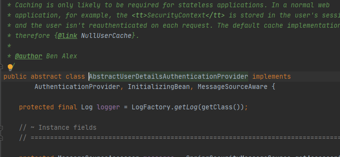
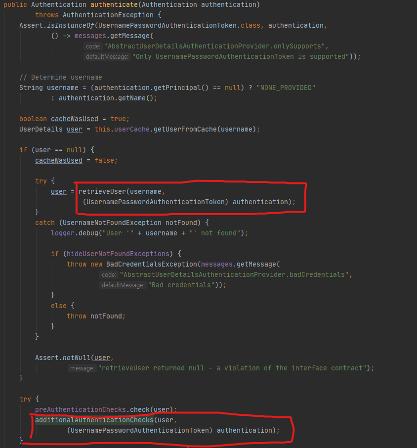
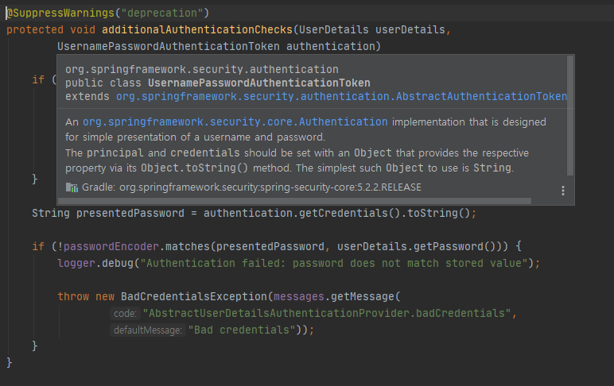

저번 포스트에서 ~~귀찮아서~~ 작성하지 못했던 security 관련 설정파일들을 작성해보자.

1. Provider 구현체 DaoAuthenticationProvider
2. UserDetailsService 구현체 CustomUserDetailsService
3. User Entity 및 UserPrincipal 
4. header인증을 위한 BasicAuthenticationFilter 구현체 JwtAuthorizationFilter
5. AuthenticationEntryPoint 구현체 CustomAuthenticationEntryPoint
6. ErrorResponseDTO

## Provider 
먼저 나는 Provider를 직접 구현하지 않고 DaoAuthenticationProvider를 사용할 예정이다. 이 클래스를 자세히보면


AbstractUserDetailsAuthenticationProvider를 상속해서 구현한 것을 알 수 있고 이클래스는 다시


AuthenticationProvider 인터페이스를 구현해놓은 것을 알 수 있다. 
이 인터페이스는 메소드로 authenticate메소드를 가지고 있으며
Authentication 을 받아 UsernamePasswordAuthenticationToken을 반환하는 역할을 한다.

하지만 추상클래스이기 때문에 authentication 메소드 안에 사용하는 함수 몇몇개들을 하위에서 implement해서 사용해야한다.
예를 들어

다음의 두 메소드이다. 하지만 나는 앞서 말했듯이 이걸사용해서 직접구현하지 않고 DaoAuthenticationProvider를 사용 할 것이다.

> 아 그리고 이건 지금 작성하면서 안 사실인데 additionalAuthenticationChecks가 deprecated될 상황이란것이다. 
>하지만 간단하게 할거니까 무시하자..
>  

```java
    @Bean
    public AuthenticationProvider authenticationProvider() {
        DaoAuthenticationProvider daoAuthenticationProvider = new DaoAuthenticationProvider();
        daoAuthenticationProvider.setPasswordEncoder(passwordEncoder());
        daoAuthenticationProvider.setUserDetailsService(customUserDetailsService);
        return daoAuthenticationProvider;
    }
```
다음과 같이 security 안에 Bean 등록을 해주고 
```java
    @Override
    protected void configure(AuthenticationManagerBuilder auth) throws Exception {
        auth.authenticationProvider(authenticationProvider());
    }
```
빌더를 통해 provider를 넣어주자! 끗

## UserDetails 

Provider는 적당히 있는 DAOauthenticationprovider를 사용했지만 나름 뭔가 커스텀한 느낌을 주기위해 UserDetailsService를 구현한 
CustomUserDetailsService를 작성해보자.

일단 현재 사용하는 Provider의 authenticate메소드를 보자. 
AbstractUserDetailsAuthenticationProvider는 현재 authenticate 메소드 안에서 retrieveUser를 호출하고
이 retrieveUser는 하위 클래스 DaoAuthenticationProvider에서 정의 되어있고   
retrieveUser 안에서 UserDetails 인터페이스의 loadByUserName을 호출하게 되는 것이다.

사실 내가 작성해도 무슨말인지 잘모르겠다. 일단 UserDetails인터페이스를 구현한 CustomUserDetailsService를 만들자

```java
@RequiredArgsConstructor
@Service
public class CustomUserDetailsService implements UserDetailsService {

    private final UserRepository userRepository;

    @Override
    @Transactional
    public UserDetails loadUserByUsername(String username) throws UsernameNotFoundException {
        User user = userRepository.findByEmail(username);
        if(user == null){
            throw new AuthenticationCredentialsNotFoundException("User not found with username or email : " + username);
        }
        return UserPrincipal.create(user);
    }

}
```
loadUserByUsername 메소드의 역할은 username(email)을 받아서 UserDetails 인터페이스를 구현한 어떤것을 반환하면 됀다.
그럼 구현해야 할것들이
1. User 엔티티
2. UserRepository
3. UserDetails 인터페이스의 구현체 -> UserPrincipal 이라고 이름지을거임 ㅎ

### User Entity
```java
// UserEntity

@Getter
@NoArgsConstructor
@Table(name ="TB_USER")
@Entity
public class User {
    @Id
    @GeneratedValue(strategy = GenerationType.IDENTITY)
    @Column(name="USER_ID")
    private Long id;

    @NotBlank
    @Column(nullable = false)
    private String email;

    @NotBlank
    @Column(nullable = false)
    private String username;

    @NotBlank
    @Column(nullable = false)
    private String password;

    @Builder
    public User(String email, String password, String username) {
        this.email = email;
        this.password = password;
        this.username = username;
    }

    @ManyToMany(fetch = FetchType.LAZY)
    @JoinTable(name = "USER_ROLE",
            joinColumns = @JoinColumn(name = "user_id"),
            inverseJoinColumns = @JoinColumn(name = "role_id"))
    private Set<Role> roles = new HashSet<>();

    public void setRoles(Set<Role> roles) {
        this.roles = roles;
    }
}
 
// UserRepository

public interface UserRepository extends JpaRepository<User,Long> {
    User findByEmail(String email);
}

// Role Entity

@NoArgsConstructor
@Table(name="ROLE")
@Getter
@Entity
public class Role {
    @Id @GeneratedValue(strategy = GenerationType.IDENTITY)
    @Column(name="ROLE_ID")
    private Long id;

    @Enumerated(EnumType.STRING)
    @Column
    private RoleName name;

    @Builder
    public Role(RoleName name) {
        this.name = name;
    }
}


// Role Repository

public interface RoleRepository extends JpaRepository<Role, Long> {
}
```

### UserPrincipal
그리고 UserPrincipal 클래스. 이 클래스는 ValueObject 즉 값을 저장하고 쓰는 공간이라고 생각하면 쉽다.

```java

@Getter
public class UserPrincipal implements UserDetails {

    private Long id;

    private String username;

    @JsonIgnore
    private String email;

    @JsonIgnore
    private String password;

    private Collection<? extends GrantedAuthority> authorities;

    public UserPrincipal(Long id, String username, String email, String password, Collection<? extends GrantedAuthority> authorities) {
        this.id = id;
        this.username = username;
        this.email = email;
        this.password = password;
        this.authorities = authorities;
    }

    public static UserPrincipal create(User user) {
        List<GrantedAuthority> authorities = user.getRoles().stream().map(role ->
                new SimpleGrantedAuthority(role.getName().name())
        ).collect(Collectors.toList());

        return new UserPrincipal(
                user.getId(),
                user.getUsername(),
                user.getEmail(),
                user.getPassword(),
                authorities
        );
    }


    @Override
    public Collection<? extends GrantedAuthority> getAuthorities() {
        return authorities;
    }

    @Override
    public String getPassword() {
        return password;
    }

    @Override
    public String getUsername() {
        return username;
    }

    @Override
    public boolean isAccountNonExpired() {
        return true;
    }

    @Override
    public boolean isAccountNonLocked() {
        return true;
    }

    @Override
    public boolean isCredentialsNonExpired() {
        return true;
    }

    @Override
    public boolean isEnabled() {
        return true;
    }

    @Override
    public int hashCode() {
        return Objects.hash(id);
    }

    @Override
    public boolean equals(Object o) {
        if (this == o) return true;
        if (o == null || getClass() != o.getClass()) return false;
        UserPrincipal that = (UserPrincipal) o;
        return Objects.equals(id, that.id);
    }
}
```

여기까지 만들고 auto import 켜둔 상태라면 CustomUserDetailsService에 빨간줄이 사라져있을 것이다.
이제 남은거는

1. ~~Provider 구현체 DaoAuthenticationProvider~~
2. ~~UserDetailsService 구현체 CustomUserDetailsService~~
3. ~~User Entity 및 UserPrincipal~~
4. header인증을 위한 BasicAuthenticationFilter 구현체 JwtAuthorizationFilter
5. AuthenticationEntryPoint 구현체 CustomAuthenticationEntryPoint
6. ErrorResponseDTO

나머지 3개는 다음포스팅때~
