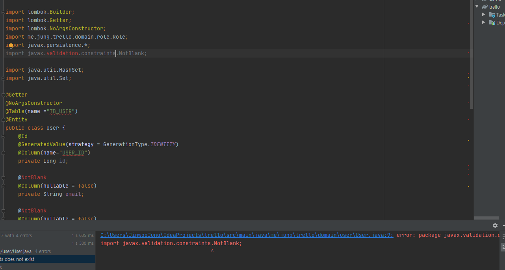

스프링부트와 리액트로 트렐로 클론코딩을 하던 도중 UserEntity내에 @NotEmpty를 사용했는데 이게 import가 안됀단다.

>?
 
나는 기존에 만들어둔 코드를 똑같이 한번더 만들면서 진행하는 거라 문제가 없을 줄 알았는데 한참을 삽질해서 겨우 알아냈다.
project를 attach해서 여러창에 띄워놔서 그런가 했는데 아니고 스프링 부트 버전 문제였다.

갓 만든 프로젝트는 스프링부트 2.3.0을 사용하고 있었고 기존에 만들어둔 프로젝트 스프링부트 버전은 2.2.6이었다..

[스택오버플로우](https://stackoverflow.com/questions/48614773/spring-boot-validation-annotations-valid-and-notblank-not-working)
답변을 참고해보면
```xml
<dependency>
    <groupId>org.springframework.boot</groupId>
    <artifactId>spring-boot-starter-validation</artifactId>
</dependency>
```
이걸 추가해줘야한다고 한다.  끗
